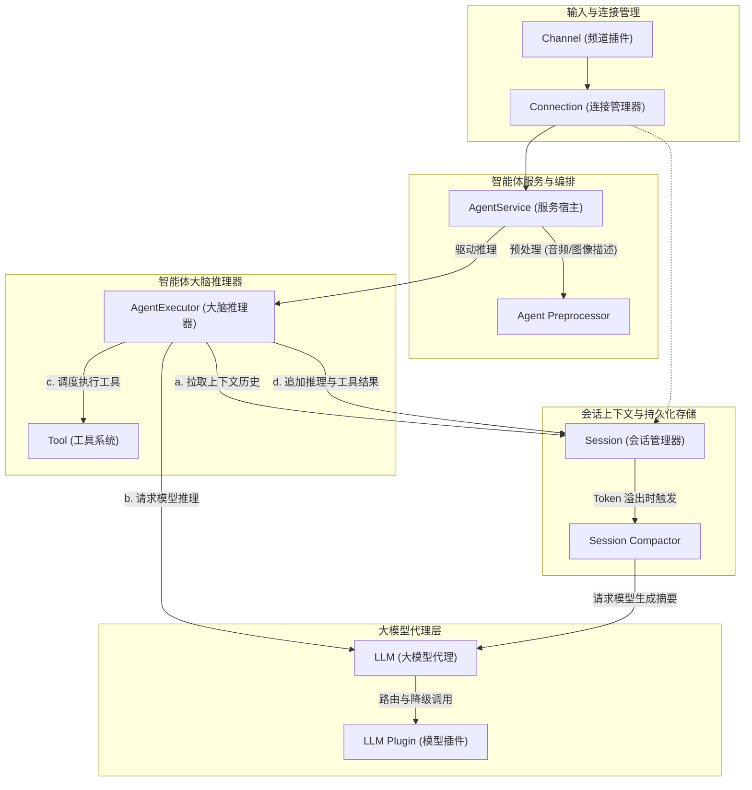

# Freya 架构设计说明

## 1. 源码目录与代码组织

源码分为内核、SDK、前端和插件 4 个独立模块：

```text
freya/
├── packages/
│   ├── core/                    # 后端单服务核心
│   │   ├── src/
│   │   │   ├── index.ts         # 入口
│   │   │   ├── kernel.ts        # 内核启动编排器
│   │   │   ├── context.ts       # 全局上下文与依赖注入定义
│   │   │   ├── logger.ts        # 统一日志器
│   │   │   ├── agent/           # 智能体内核
│   │   │   ├── channel/         # 频道模块
│   │   │   ├── command/         # 命令注册与解析器
│   │   │   ├── config/          # 配置管理器
│   │   │   ├── connection/      # 连接管理器
│   │   │   ├── event/           # 异步事件总线
│   │   │   ├── llm/             # 大模型插件注册与代理
│   │   │   ├── plugin/          # 插件管理器与注册表
│   │   │   ├── prompt/          # 系统提示词管理器
│   │   │   ├── session/         # 会话管理器
│   │   │   ├── skill/           # 技能卡注册与管理
│   │   │   ├── tools/           # 工具注册表与内置系统工具集
│   │   │   ├── billing/         # 计费服务
│   │   │   ├── web/             # 内嵌 Web 容器
│   │   │   └── utils/           # 工具函数
│   │   ├── config/              # 包内默认配置
│   │   │   └── prompts/         # 默认提示词 Markdown 模板
│   │   └── package.json
│   │
│   ├── sdk/                     # 插件开发标准 SDK
│   │   ├── src/
│   │   │   ├── index.ts         # 模块入口与集中导出
│   │   │   └── types.ts         # 统一的接口定义
│   │   └── package.json
│   │
│   └── ui/                      # 独立的前端 Web 交互页面
│       └── package.json
│
├── plugins/                     # 插件根目录
│   ├── plugin-openai/           # 对接 OpenAI 标准 API 的大模型插件
│   ├── plugin-telegram-channel/ # Telegram 频道插件
│   ├── plugin-tool-fs/          # 文件系统工具插件
│   ├── plugin-tool-memory/      # 记忆工具插件
│   └── plugin-tool-web/         # 网页工具插件
└── skills/                      # 物理技能卡目录 (系统启动时动态扫描加载全量 *.md 技能卡)
```


### 依赖规则（硬约束）
- **插件只能依赖 `@eoasmxd/freya-sdk`**：插件目录（`plugins/*`）在代码里只允许导入 SDK，严禁直接引用 `@eoasmxd/freya-core` 内部实现。
- **内核不依赖具体插件**：`core` 内部不硬编码引用任何具体插件类，保持核心独立性。

---

## 2. 核心调用关系与组件职责

各组件通过**基于全局上下文的依赖注入**与**发布/订阅事件机制**实现高内聚低耦合的协同：

### 2.1 核心调用关系图


### 2.2 核心组件主要职责
*   **`Channel` (频道插件)**：屏蔽物理世界不同聊天客户端（控制台 CLI、WebSocket、Telegram Bot 等）的协议差异，处理物理输入输出。
*   **`Connection` (连接管理器)**：连接层中间转换器与生命周期路由器，拦截通道消息，动态映射/创建对应的逻辑 `Session`，并将消息路由至 `AgentService` 模块。
*   **`AgentService` (智能体服务宿主)**：充当会话流与子智能体生命周期的编排宿主与控制枢纽。
*   **`AgentExecutor` (智能体大脑推理器)**：控制智能体的思考-决策-执行 (ReAct) 闭环迭代。
*   **`Session` (会话管理器)**：管理内存会话缓存与物理磁盘（`data/sessions/`）的持久化，内置 `SessionCompactor` 历史摘要生成机制。
*   **`LLM` (大模型代理与路由)**：支持故障自动转移（Failover）和备选模型轮询，屏蔽不同提供商 API 差异。

---

## 3. 底层异步通信机制 (EventBus)

底座组件之间跨边界异步通信统一通过 **`EventBus` (事件总线)** 异步事件驱动：

*   **出站路由**：`Agent` 推理产生的流式 Delta 或最终文本不会被直接投递给 `Channel`。底座仅需广播 `'connection:reply'` / `'connection:reply:delta'` 事件；各个 `Channel` 插件自行订阅事件，读取对应的 `channelId` 并各自向用户的物理长连接发送。
*   **多方协同与计费解耦**：当大模型输出产生 `'token:consumed'` 事件时，计费服务（Billing）通过订阅该事件核算费用并广播计费结果，底座连接层再通过 `'connection:event'` 向前端 WebSocket 实时推送 Token 账单与费用通知。


---

## 4. 打包分发结构 (`dist/`)

运行 `pnpm build` 时，`scripts/distribute.js` 会把编译好的代码和资源整理到物理 `dist/` 目录下：

```text
dist/
├── freya.js               # 启动脚本
├── package.json           # 最终运行/发布的 package.json
├── core/                  # core 编译产物
├── sdk/                   # sdk 编译产物
├── ui/                    # 前端打包产物
├── plugins/               # 插件编译产物与 schema.json
├── config/                # 初始默认提示词
├── skills/                # 预置技能卡
├── doc/                   # 文档文件
└── src/                   # 独立镜像的全量源码，供 AI Agent 只读检索学习
```
